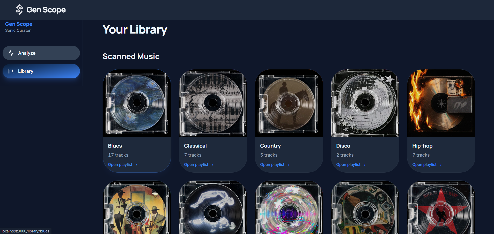
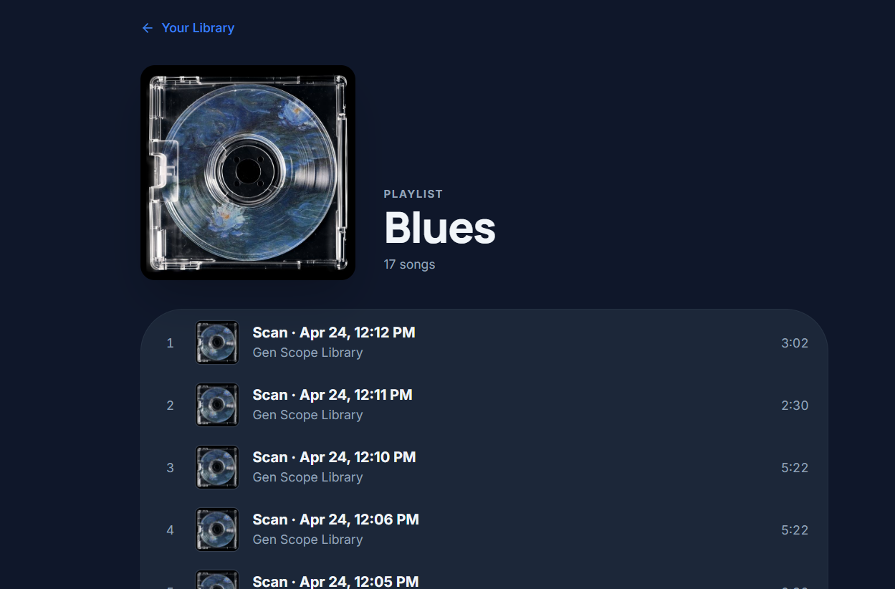
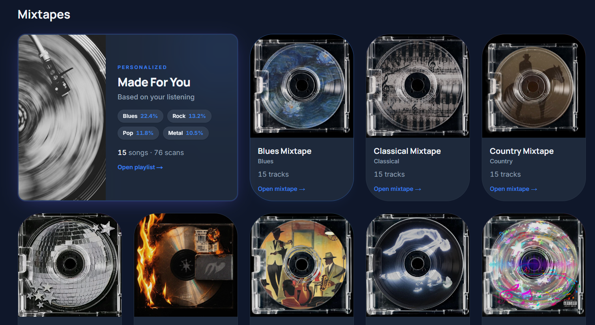
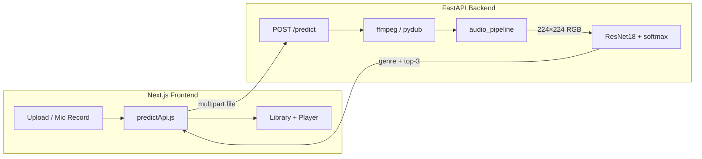

# Gen Scope

**AI-powered music genre detection — from microphone to mixtape.**

[](https://www.python.org/)
[](https://fastapi.tiangolo.com/)
[](https://pytorch.org/)
[](https://nextjs.org/)
[](https://tailwindcss.com/)

---

## Project Overview

**Gen Scope** is a full-stack web application that listens to music—via upload or live recording—and predicts its genre using a convolutional neural network trained on Mel spectrograms. The backend exposes a FastAPI inference API backed by a fine-tuned **ResNet18** checkpoint; the frontend is a **Next.js** app with a Music library, scanned-track playlists, genre mixtapes, and an integrated music player.

The system converts audio into a **128-band Mel spectrogram** (10-second centered segment, 22.05 kHz), renders it as a clean RGB image (224×224), and classifies it into one of **10 GTZAN genres**: blues, classical, country, disco, hiphop, jazz, metal, pop, reggae, and rock.

---

## Table of Contents

1. [Motivation](#motivation)
2. [Build Status](#build-status)
3. [Code Style](#code-style)
4. [Screenshots](#screenshots)
5. [Technologies / Frameworks Used](#technologies--frameworks-used)
6. [Features](#features)
7. [Architecture & Workflow](#architecture--workflow)
8. [Folder Structure](#folder-structure)
9. [Code Examples](#code-examples)
10. [Installation](#installation)
11. [API Reference](#api-reference)
12. [Tests](#tests)
13. [Contribute](#contribute)
14. [Credits](#credits)
15. [License](#license)

---

## Motivation

Music genre classification is a foundational task in music information retrieval. It powers recommendation systems, playlist curation, royalty reporting, and exploratory discovery tools. Manual tagging does not scale; listeners need fast, consistent labels across large libraries.

**Gen Scope** was built to make genre detection accessible in the browser: record or upload a clip, receive an instant prediction with confidence scores, and explore results through curated playlists. The project solves the gap between research-grade spectrogram classifiers and a polished end-user experience.

**Why AI + spectrograms?** Genres differ in timbre, rhythm, and harmonic content—patterns that appear clearly in time–frequency representations. Mel spectrograms compress raw waveforms into images that CNNs excel at recognizing. Transfer learning from **ImageNet-pretrained ResNet18** provides strong low-level features while the final layer adapts to music-specific classes trained on the **GTZAN Genre Dataset**.

---

## Build Status

| Area | Status |
|------|--------|
| File upload prediction | ✅ Stable (WAV, MP3, WebM via server conversion) |
| Next.js UI (scan + library) | ✅ Functional |
| FastAPI `/predict` API | ✅ Production-ready for local dev |
| Model training pipeline | ✅ Complete (`train_model.py`) |
| Live mic (CLI `live_predict.py`) | ⚠️ Experimental — device-dependent |
| Trained weights in repo | ⚠️ Place `models/music_genre_cnn.pth` locally after training |

### Known limitations

- **Live microphone prediction** can be inconsistent in noisy environments; browser recordings depend on codec support and room acoustics.
- **BPM and key** badges on the home screen (`124 BPM`, `Key: G# Minor`) are **UI placeholders only**—they are not computed from audio analysis.
- **Prediction quality** depends on audio quality, clip length (~10 s analyzed), and similarity to GTZAN training data.
- **ffmpeg** must be on `PATH` for reliable MP3/WebM conversion; `pydub` is used as a fallback.
- **`app.py`** may include a machine-specific ffmpeg path on Windows—adjust or remove before deploying elsewhere.
- The model is trained on **10 genres**; out-of-distribution music (e.g., electronic, folk) may be misclassified.

---

## Code Style

The codebase follows consistent conventions across Python and JavaScript:

| Layer | Convention | Examples |
|-------|------------|----------|
| Python modules | `snake_case` files | `audio_pipeline.py`, `generate_mel_spectrogram.py` |
| Python functions | `snake_case` | `process_audio_file`, `load_model_and_classes` |
| React components | `PascalCase` | `ResultDisplay.jsx`, `MusicPlayerBar.jsx` |
| React hooks / libs | `camelCase` | `useScannedMusic`, `postPredictAudio`, `genreToSlug` |
| Constants | `UPPER_SNAKE_CASE` | `SAMPLE_RATE`, `MODEL_PATH`, `RECORD_MS` |

**Folder organization**

- **Root**: ML training, spectrogram generation, FastAPI server, shared `audio_pipeline.py`
- **`frontend/`**: Next.js App Router (`app/`), reusable `components/`, state in `contexts/`, logic in `lib/` and `hooks/`
- **`static/`**: Legacy single-page UI served by FastAPI at `/static/gen_scope.html`

**Component structure (frontend)**

- Page shells in `app/` compose layout + data hooks
- Presentational components (`UploadCard`, `GenreScanCard`) receive props and callbacks
- API and persistence live in `lib/` (`predictApi.js`, `scannedMusicStore.js`)

**Backend modularization**

- `generate_mel_spectrogram.py` — Mel generation, dB scale, PNG rendering
- `audio_pipeline.py` — **shared preprocessing pipeline** used by API, CLI, and training-aligned inference
- `app.py` — HTTP layer, format conversion, model I/O
- `train_model.py` — dataset loaders, ResNet18 fine-tuning, checkpoint export

---

## Screenshots


### Home Page — Genre Detection


### Home Page — Top Predictions & Confidence


### Library Page — Scanned Music


### Genre Playlist — Scanned Tracks


### Mixtape Page


### Music Player Bar


---

## Technologies / Frameworks Used

| Technology | Role in Gen Scope |
|------------|-------------------|
| **FastAPI** | Async REST API, file upload handling, CORS, static file hosting |
| **PyTorch** | Model training, inference, checkpoint load/save |
| **torchvision** | ResNet18 backbone, `ImageFolder` dataloaders, `ToTensor` transforms |
| **librosa** | Audio loading, Mel spectrogram features, dB conversion |
| **NumPy** | Numerical audio buffers, segment slicing |
| **Matplotlib** | Spectrogram visualization and PNG export for CNN input |
| **Next.js** | App Router, SSR metadata, production React framework |
| **React** | Client components, hooks, player context |
| **Tailwind CSS** | Utility-first responsive UI and design tokens |
| **ffmpeg** (`ffmpeg-python`) | Server-side conversion of MP3/WebM uploads to mono WAV @ 22.05 kHz |
| **pydub** | Fallback audio decode/export when ffmpeg fails |
| **scikit-learn** | Confusion matrix and validation metrics during evaluation |
| **noisereduce** | Optional spectral gating in CLI live-mic pipeline |
| **soundfile / sounddevice** | CLI microphone capture and WAV I/O (`live_predict.py`) |
| **Pillow** | RGB image load/resize for model input |
| **IndexedDB + localStorage** | Persist scanned tracks in the browser |

---

## Features

- **Audio upload** — drag-and-drop or file picker; supports common formats converted server-side
- **Live recording** — 10-second browser microphone capture (WebM/Opus → server conversion)
- **CNN genre prediction** — ResNet18 on Mel-spectrogram images
- **Spectrogram preprocessing** — shared `audio_pipeline.py` aligned with training
- **Confidence score** — softmax probability for the top class
- **Top-3 genre predictions** — ranked alternatives with per-class confidence
- **Scanned genre playlists** — auto-save predictions to IndexedDB, grouped by genre
- **Genre mixtapes** — curated static playlists per genre under `frontend/public/audio/`
- **Made For You** — blended playlist weighted by your scan history
- **Music player** — queue, play/pause, seek, next/previous (`MusicPlayerContext`)
- **Responsive UI** — mobile-friendly grid layouts and sidebar navigation
- **Automatic audio conversion** — ffmpeg + pydub normalize uploads to WAV
- **Saved scanned tracks** — replay uploads from the library without re-uploading
- **Legacy static UI** — `static/gen_scope.html` served at `/` when static files exist
- **Training & evaluation scripts** — batch spectrograms, training loop, confusion matrix export
- **CLI tools** — `predict_file.py`, `live_predict.py` for offline testing

---

## Architecture & Workflow



**Inference pipeline (summary)**

1. Client sends audio as `multipart/form-data` (`file` field).
2. Server writes a temp file; non-WAV inputs convert to mono WAV (22.05 kHz).
3. `process_audio_file()` loads audio, extracts a centered **10 s** segment, builds Mel spectrogram → dB → PNG → RGB 224×224.
4. ResNet18 forward pass → argmax genre + **top-3** softmax scores.
5. Frontend displays results and optionally persists the blob to **IndexedDB**.

---

## Folder Structure

```
Music-Genre-Detection-using-CNN-Spectrograms/
├── app.py                      # FastAPI server + /predict
├── audio_pipeline.py           # Shared inference preprocessing
├── generate_mel_spectrogram.py   # Mel spec generation & PNG export
├── batch_generate_spectrograms.py
├── train_model.py              # ResNet18 training on spectrograms_10s/
├── generate_confusion_matrix.py
├── predict_file.py             # CLI file prediction
├── live_predict.py               # CLI microphone prediction
├── requirements.txt
├── models/
│   └── music_genre_cnn.pth     # Trained checkpoint (not in git — train locally)
├── static/                     # Legacy HTML/JS UI
│   ├── gen_scope.html
│   └── gen_scope.js
└── frontend/
    ├── app/
    │   ├── page.jsx            # Home — scan & predict
    │   └── library/            # Library, genre, mixtape routes
    ├── components/             # UI components (PascalCase)
    ├── contexts/               # MusicPlayerContext
    ├── hooks/                  # useScannedMusic, useMadeForYouPlaylist
    ├── lib/                    # API client, storage, genre utils
    ├── data/mixtapes.js        # Mixtape metadata
    └── public/                 # Audio assets, covers
```

---

## Code Examples

### Load ResNet18 checkpoint (FastAPI)

```python
def load_model_and_classes(checkpoint_path: str = MODEL_PATH):
    checkpoint = torch.load(checkpoint_path, map_location="cpu")
    class_names = checkpoint["class_names"]

    model = models.resnet18(weights=None)
    in_features = model.fc.in_features
    model.fc = nn.Linear(in_features, len(class_names))
    model.load_state_dict(checkpoint["model_state_dict"])
    model = model.to("cpu")
    model.eval()

    return model, class_names
```

### Generate Mel spectrogram

```python
def generate_mel_spectrogram(y, sr=22050, n_mels=128, n_fft=2048, hop_length=512):
    mel_spec = librosa.feature.melspectrogram(
        y=y,
        sr=sr,
        n_mels=n_mels,
        n_fft=n_fft,
        hop_length=hop_length
    )
    return mel_spec
```

### Shared audio preprocessing pipeline

```python
def process_audio_file(file_path: str, sr: int = SAMPLE_RATE) -> Image.Image:
    y, _ = librosa.load(file_path, sr=sr)
    segment_length = sr * SEGMENT_SECONDS
    start = max(0, (len(y) - segment_length) // 2)
    y = y[start : start + segment_length]

    mel_spec = generate_mel_spectrogram(y=y, sr=sr, n_mels=N_MELS, n_fft=N_FFT, hop_length=HOP_LENGTH)
    mel_spec_db = convert_to_decibels(mel_spec)
    # ... render PNG, load RGB, resize to 224×224
    return image
```

### FastAPI prediction route with top-3 scores

```python
@app.post("/predict")
async def predict(file: UploadFile = File(...)):
    # ... save upload, convert to WAV if needed
    image = process_audio_file(input_path, SAMPLE_RATE)
    input_tensor = image_transform(image).unsqueeze(0).to("cpu")

    with torch.no_grad():
        logits = model(input_tensor)
        probs = torch.softmax(logits, dim=1)[0]
        pred_idx = int(torch.argmax(logits, dim=1).item())
        confidence = float(probs[pred_idx].item())
        top_probs, top_indices = torch.topk(probs, 3)
        top_predictions = [
            {"genre": class_names[idx], "confidence": float(top_probs[rank].item())}
            for rank, idx in enumerate(top_indices.tolist())
        ]

    label = class_names[pred_idx]
    return {
        "predicted_genre": label,
        "genre": label,
        "confidence": confidence,
        "top_predictions": top_predictions,
    }
```

### React — POST audio to `/predict`

```javascript
export async function postPredictAudio(file) {
  const base = getPredictBaseUrl();
  const formData = new FormData();
  formData.append("file", file, file.name || "recording.webm");

  const res = await fetch(`${base}/predict`, {
    method: "POST",
    body: formData,
  });
  // ... parse JSON, surface API errors
  return data;
}
```

### Automatic WAV conversion (ffmpeg + pydub fallback)

```python
def ensure_wav_input(audio_path: str, content_type: str | None) -> tuple[str, bool]:
    if audio_path.lower().endswith(".wav"):
        return audio_path, False

    fd, wav_path = tempfile.mkstemp(suffix=".wav")
    os.close(fd)
    try:
        (
            ffmpeg
            .input(audio_path)
            .output(wav_path, acodec="pcm_s16le", ac=1, ar=str(SAMPLE_RATE), format="wav")
            .overwrite_output()
            .run(quiet=True)
        )
        return wav_path, True
    except Exception:
        audio = AudioSegment.from_file(audio_path)
        audio = audio.set_channels(1).set_frame_rate(SAMPLE_RATE)
        audio.export(wav_path, format="wav")
        return wav_path, True
```

---

## Installation

### Prerequisites

- **Python 3.10+**
- **Node.js 18+** and npm
- **ffmpeg** on your system `PATH` ([download](https://ffmpeg.org/download.html))
- **GTZAN dataset** (for training only) — place under `genres_original/` mirroring genre folders
- Trained weights at `models/music_genre_cnn.pth` (run training or copy your checkpoint)

### 1. Clone the repository

```bash
git clone https://github.com/<your-username>/Music-Genre-Detection-using-CNN-Spectrograms.git
cd Music-Genre-Detection-using-CNN-Spectrograms
```

### 2. Python environment & dependencies

```bash
python -m venv venv

# Windows
venv\Scripts\activate

# macOS / Linux
source venv/bin/activate

pip install --upgrade pip
pip install -r requirements.txt
pip install fastapi uvicorn[standard] python-multipart torch torchvision Pillow pydub ffmpeg-python
```

> **Note:** Install PyTorch from [pytorch.org](https://pytorch.org/) if you need a specific CUDA build.

### 3. Train or obtain the model (if missing)

```bash
# Optional: generate spectrograms from raw audio
python batch_generate_spectrograms.py

# Train ResNet18 (outputs models/music_genre_cnn.pth)
python train_model.py
```

### 4. Frontend dependencies

```bash
cd frontend
npm install
```

Optional — point the UI at a remote API:

```bash
# frontend/.env.local
NEXT_PUBLIC_API_URL=http://127.0.0.1:8000
```

### 5. Run the backend

From the repository root (with venv activated):

```bash
uvicorn app:app --reload --host 127.0.0.1 --port 8000
```

API docs: [http://127.0.0.1:8000/docs](http://127.0.0.1:8000/docs)

### 6. Run the frontend

```bash
cd frontend
npm run dev
```

Open [http://localhost:3000](http://localhost:3000)

---

## API Reference

Base URL (default): `http://127.0.0.1:8000`

### `GET /`

| | |
|---|---|
| **Purpose** | Health check; redirects to legacy static UI when `static/` exists |
| **Request body** | None |
| **Example response** | Redirect to `/static/gen_scope.html` or `{"message": "Music Genre Classifier API is running"}` |

---

### `POST /predict`

| | |
|---|---|
| **Purpose** | Classify uploaded audio into a GTZAN genre |
| **Content-Type** | `multipart/form-data` |
| **Form field** | `file` — audio file (`.wav`, `.mp3`, `.webm`, etc.) |

**Example response (200)**

```json
{
  "predicted_genre": "jazz",
  "genre": "jazz",
  "confidence": 0.87,
  "top_predictions": [
    { "genre": "jazz", "confidence": 0.87 },
    { "genre": "blues", "confidence": 0.06 },
    { "genre": "classical", "confidence": 0.03 }
  ]
}
```

**Example error (400)**

```json
{
  "detail": "ValueError: Loaded audio is empty."
}
```

---

### `GET /docs`

| | |
|---|---|
| **Purpose** | Interactive Swagger UI (auto-generated by FastAPI) |
| **Request body** | None |

---

### `GET /redoc`

| | |
|---|---|
| **Purpose** | ReDoc API documentation |
| **Request body** | None |

---

### `GET /openapi.json`

| | |
|---|---|
| **Purpose** | OpenAPI 3 schema for the service |
| **Request body** | None |

---

### `GET /static/{path}`

| | |
|---|---|
| **Purpose** | Serve legacy Gen Scope static assets (`gen_scope.html`, `gen_scope.js`) |
| **Request body** | None |

---

### Frontend routes (Next.js)

| Route | Description |
|-------|-------------|
| `/` | Home — upload, record, display prediction |
| `/library` | Scanned music grid + mixtapes |
| `/library/[genre]` | Scanned tracks for one genre |
| `/library/mixtape/[genre]` | Static genre mixtape playlist |
| `/library/made-for-you` | Personalized blend from scan history |

---

## Tests

The following validation approaches were used during development:

1. **Postman / Swagger UI** — manual `POST /predict` with varied `Content-Type` and file extensions
2. **Upload testing** — drag-and-drop and file-picker flows through the Next.js home page
3. **WAV and MP3 testing** — direct WAV uploads vs ffmpeg/pydub conversion paths
4. **Live recording tests** — 10 s `MediaRecorder` WebM clips sent to `/predict`
5. **Confusion matrix evaluation** — `python generate_confusion_matrix.py` on the validation split
6. **Validation accuracy testing** — epoch-level val accuracy in `train_model.py` with early stopping
7. **CLI regression** — `python predict_file.py "sample.wav"` against known GTZAN clips

---

## Contribute

Contributions are welcome. High-impact areas:

- **UI/UX** — accessibility, dark/light themes, real BPM/key estimation, better error states
- **Model optimization** — deeper architectures, ensembling, calibration, longer context windows
- **Datasets** — FMA, Million Song Dataset subsets, or custom labeled data beyond GTZAN
- **Music analysis** — tempo/key detection, mood tags, instrument recognition
- **Performance** — GPU inference, batch API, model quantization, edge deployment
- **DevOps** — Docker Compose, remove hardcoded ffmpeg paths, CI for lint + smoke tests

1. Fork the repository  
2. Create a feature branch (`git checkout -b feature/amazing-feature`)  
3. Commit your changes  
4. Open a Pull Request  

---

## Credits

- **[GTZAN Genre Dataset](http://marsyas.info/downloads/datasets.html)** — 10-genre, 100-track-per-genre corpus used for training
- **[PyTorch](https://pytorch.org/docs/)** — training and inference framework
- **[torchvision ResNet18](https://pytorch.org/vision/stable/models.html)** — pretrained backbone
- **[librosa](https://librosa.org/doc/latest/index.html)** — audio analysis and Mel spectrograms
- **[FastAPI](https://fastapi.tiangolo.com/)** — API server
- **[Next.js](https://nextjs.org/docs)** — React application framework
- **[Tailwind CSS](https://tailwindcss.com/docs)** — styling system
- UI inspiration from modern music streaming applications (library grids, mixtapes, persistent player bar)

---

<p align="center">
  <strong>Gen Scope</strong> — The Sonic Curator experience. 🎵
</p>
